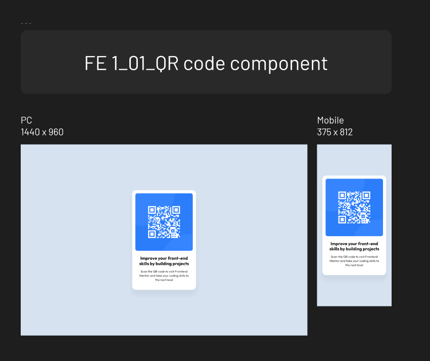

# Frontend Mentor - QR code component solution

This is a solution to the [QR code component challenge on Frontend Mentor](https://www.frontendmentor.io/challenges/qr-code-component-iux_sIO_H). Frontend Mentor challenges help you improve your coding skills by building realistic projects.

## Table of contents

- [Overview](#overview)
  - [Screenshot](#screenshot)
  - [Links](#links)
- [My process](#my-process)
  - [Built with](#built-with)
  - [What I learned](#what-i-learned)

## Overview

### Screenshot

### Links

- Solution URL: [https://github.com/zeegu/frontend-mentor-qrcode/]
- Live Site URL: [https://zeegu.github.io/frontend-mentor-qrcode/]

## My process

### Built with

- Semantic HTML5 markup
- CSS custom properties
- Flexbox

### What I learned

General

- Checking design elements through Figma

HTML

- How to write efficient html structure

CSS

- How to use variables more efficiently with root specification
- Applying repeated css style elements through .class-names
- Center alignment with flexbox
